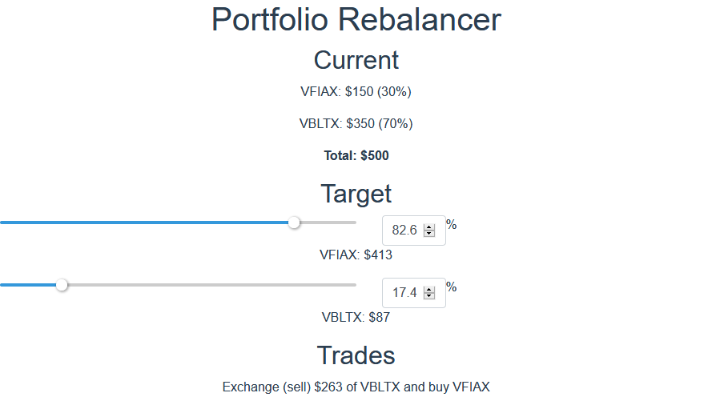
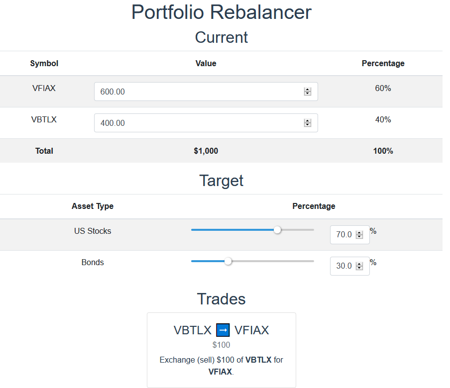
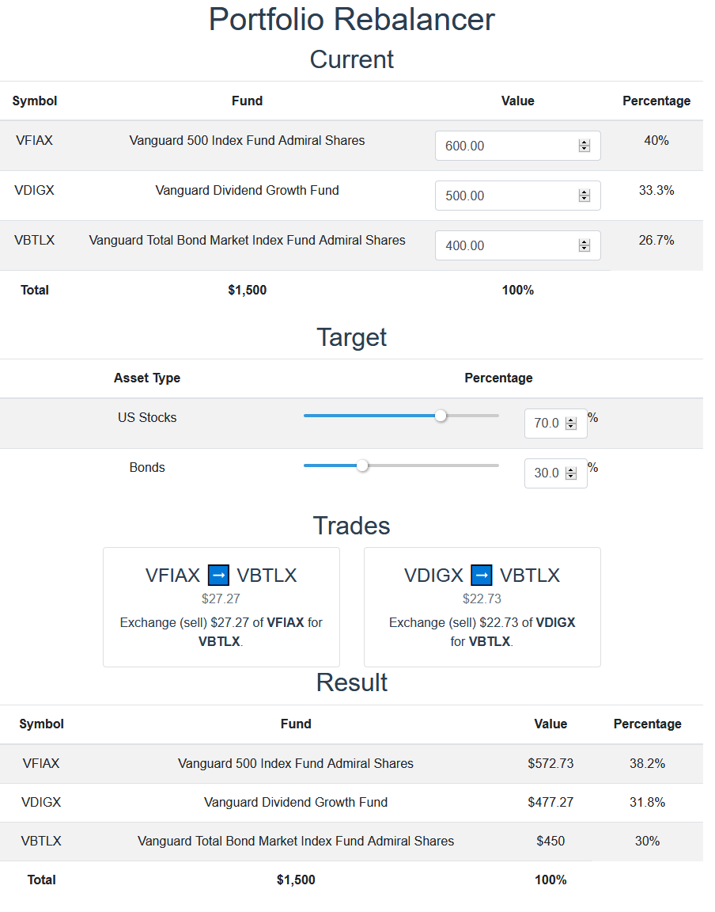
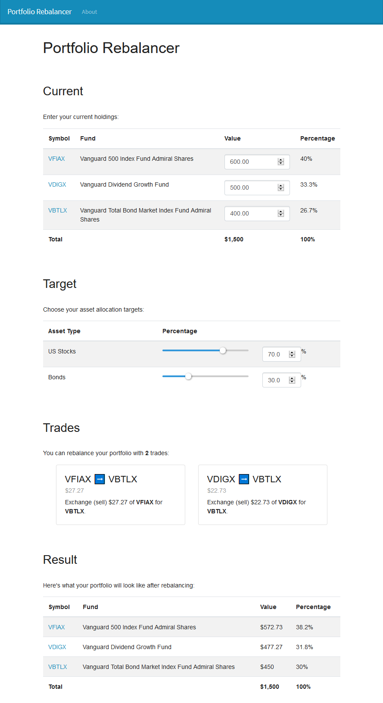

## [Portfolio Rebalancer](https://rebalancer.mtlynch.io/)

The portfolio rebalancer is a new project I started this week to [rebalance portfolios](https://www.bogleheads.org/wiki/Rebalancing) so that the investor can maintain a particular ratio of assets. For example, you could say, "I want to 30% of my money in US stocks, 20% in international stocks, and 50% in bonds. Here's my current portfolio." And the rebalancer will tell you what assets to exchange so that you're at the balance you want.

- Here's a visual diary of my progress.
  - 
    - Basic functionality works!
    - It can rebalance a portfolio with up to TWO holdings.
    - Spent lots of time figuring out how to wrap bootstrap-vue components so that they have the same functionality but work on arbitrary-precision numbers instead of JS-native number types (which are too imprecise for financial calculations).
  - 
    - Put everything into nicer UI components like tables and cards to make everything feel more organized.
    - Started moving business logic out of the Vue components and into TypeScript controllers, where it's easier to write unit tests for them.
  - 
    - Implemented support for portfolios with up to 3 holdings.
    - Created a Firebase project to host it ([https://rebalancer.mtlynch.io](https://rebalancer.mtlynch.io) for now)
    - Added a CircleCI config for automatic deployment and testing
    - Spent hours trying to figure out how to use TypeScript enums as dictionary indices before finally giving up and converting the enums to const instances of a class.
  - 
    - Added a bootstrap theme
    - Added a navbar
    - Wrote an About page
    - Added helper text to explain what each section is.
- It's now _sort of_ working for up to 3 investments.
  - I say sort of because it currently suggests trades as low as $0.01 to be perfectly balanced, but I need to put in some minimum threshold where within .1% or so should be considered fine.
- I've got it running in Firebase on a placeholder URL: [https://rebalancer.mtlynch.io](https://rebalancer.mtlynch.io)
- I added a navbar, about page, and a CircleCI configuration to automatically test and deploy every commit.
- This is my first time configuring a Vue project with TypeScript, and it's kind of neat.
  - I'll admit that it's a bit annoying to have TypeScript complaining about things like "this variable might be undefined" when I'm used to an extremely passive JavaScript that does whatever I say, no matter how dumb it is.

## [NERD Summit](https://nerdsummit.org/)

- Delivered my talk at NERD Summit ([slides](https://decks.mtlynch.io/nerds-2020/#/))
  - Also did lots of rehearsal runs.
    - Thanks to my girlfriend for being my test audience.

## [WanderJest](http://wanderjest.com)

- Announced WanderJest's [official hiatus](TNRCF4I.webp) until the COVID-19 pandemic has subsided.
- Continued arranging a meeting with a comedian who runs a similar site in another city.
- Marked lots of events canceled or rescheduled.

## [mtlynch.io](https://mtlynch.io)

- Upgraded to Hugo 0.67.0 ([#547](https://github.com/mtlynch/mtlynch.io/pull/547))
- Removed a dead link ([#544](https://github.com/mtlynch/mtlynch.io/pull/544))
- Realized I have a bunch of dead links but htmlproofer isn't finding them
  - I have htmlproofer set to only report 4xx errors because it otherwise gets too many false positives, but that means I miss links that permanently get 5xx errors or where the server simply isn't serving anymore.
  - I'm trying to switch to [htmltest](https://github.com/wjdp/htmltest), which has the advantage of being Go-native (htmlproofer is Ruby), but I'm struggling to fix the false positives. ([#546](https://github.com/mtlynch/mtlynch.io/pull/546))
    - Submitted a small Docker improvement to htmltest ([#144](https://github.com/wjdp/htmltest/pull/144))

## [What Got Done](https://whatgotdone.com)

- Consolidated e2e tests into integration tests ([#489](https://github.com/mtlynch/whatgotdone/pull/489), [#490](https://github.com/mtlynch/whatgotdone/pull/490))
  - e2e tests only existed because some tests required an initial state like "add a reaction to this user's pre-existing entry"
  - That was hard to replicate with my integration tests because the integration tests start with a fresh datastore, and I didn't want to have to depend on a particular ordering of tests (e.g. only test reactions after we've tested posting so that the post is there).
  - Instead, I added a second server to my docker-compose setup that shares the datastore with the WanderJest test environment but can initialize and reset the datastore
  - Now Cypress calls this second server with the `/reset` HTTP request [before each test](https://github.com/mtlynch/whatgotdone/blob/adb5fc0c4de7d22257ebc8207b557688bf936688/integration/cypress/support/index.js#L4-L6).
  - I manage the "initial state" data in a [simple YAML file](https://github.com/mtlynch/whatgotdone/blob/adb5fc0c4de7d22257ebc8207b557688bf936688/test-data-manager/integration-data.yaml).
  - This is a big win because now any developer can run all of my tests with a single command. The integration tests run their own local Firestore server, so it doesn't depend on any external state.

## Misc

- Lots of emailing friends to check in on how they're doing with COVID-19.
- Diagnosed why my [home VM server](https://mtlynch.io/building-a-vm-homelab/) was running out of local disk
  - There were lots of images on the disk, but I couldn't figure out which VMs they were associated with, because they're just labeled with random UUIDs.
  - I'm using KVM/virsh, so the solution was:
    1. Call `virsh vol-list <my-volume-pool> --details`
    1. For large images, find the VM that's using it by doing `virsh domname <image UUID>`
    1. If it's an orphaned image, delete it with `virsh vol-delete <image path>`
- Updated the Sia Docker Image to [1.4.4 ](https://hub.docker.com/layers/mtlynch/sia/1.4.4/images/sha256-c8862fbc703e1f218f1c52bda142f4225a38423b13e39c025eb1b0e165ad5307?context=explore)
  - And then [whined a lot](https://www.reddit.com/r/siacoin/comments/fku4wt/we_just_released_sia_v144/fkvgrmm/) on reddit about Sia's annoying release process.
- Window shopped some new VM server hardware since my build is now almost 3 years old and I can build a much better one based on what I've learned about my usage these past few years.

## Beekeeping

- Did my second post-winter quick inspection
  - Sadly, one of my two hives died.
    - They seem to have run out of honey in the last 10 days. It looks like the sugar patties I fed them on last inspection weren't enough.
  - The other hive seems to be pretty healthy, but I'm going to supplement their food ASAP.

## [Dusty VCR Podcast](https://dustyvcr.com)

- Postponed all meetings and recording dates indefinitely due to COVID-19.
